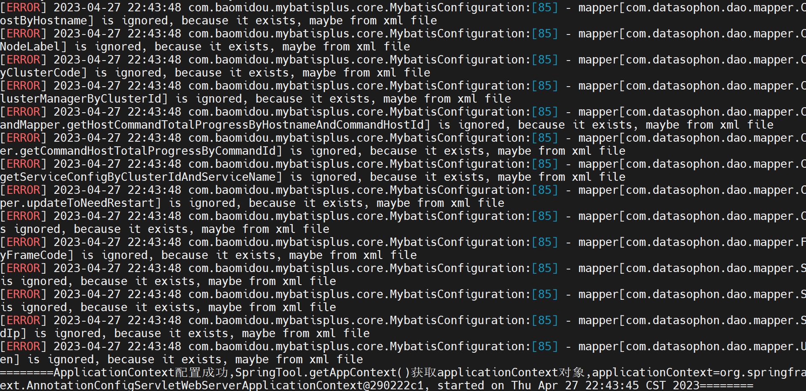

## 部署mysql

注意需关闭mysql ssl功能。在部署过程中，部分组件会执行sql生成库表，不同环境的mysql在配置上存在差异，可根据sql执行情况，变更mysql配置。

## 执行数据脚本

```
CREATE DATABASE IF NOT EXISTS datasophon DEFAULT CHARACTER SET utf8;
grant all privileges on *.* to datasophon@"%" identified by 'datasophon' with grant option;
GRANT ALL PRIVILEGES ON *.* TO 'datasophon'@'%';
FLUSH PRIVILEGES;
```


执行datasophon-manager安装目录sql目录下datasophon.sql，创建数据表。

## 下载DDP部署包

DDP部署包下载地址：

链接：https://pan.baidu.com/s/1GREAydTUrfcyXhn_Hr-9xw?pwd=bj7k 
提取码：bj7k 

在/opt/datasophon目录下创建目录

```
mkdir -p /opt/datasophon/DDP/packages
```

将下载的部署包上传到/opt/datasophon/DDP/packages目录下，作为项目部署包仓库地址。


## 部署DataSophon

### 1 部署目录介绍

在安装目录下解压[datasophon-manager-{version}.tar.gz](https://github.com/datasophon/datasophon/releases)，解压后可以看到如下安装目录：

 

bin：启动脚本git

conf ：配置文件

lib ：项目依赖的jar包

logs:项目日志存放目录

jmx：jmx插件

### 2 修改配置

修改 conf 目录下的application.yml 配置文件中数据库链接配置：

```
spring:
  datasource:
    type: com.alibaba.druid.pool.DruidDataSource
    url: jdbc:mysql:ddp1:3306/datasophon?useUnicode=true&characterEncoding=utf-8
    username: root
    password: ddp1
    driver-class-name: com.mysql.jdbc.Driver
```

### 3 启动服务

```
启动：sh bin/datasophon-api.sh start api
停止：sh bin/datasophon-api.sh stop api
重启：sh bin/datasophon-api.sh restart api
```

部署成功后，可以进行日志查看，日志统一存放于logs文件夹内:

 logs/

  ├── ddh-api.log

  ├── ddh-api-error.log

  |—— api-{hostname}.out

**项目启动后会出现mapper异常，该异常对项目无影响，可忽略。**



## 访问页面

访问前端页面地址,接口ip(自行修改) [http://192.168.xx.xx:8081/ddh，默认用户名和密码为admin/admin123
